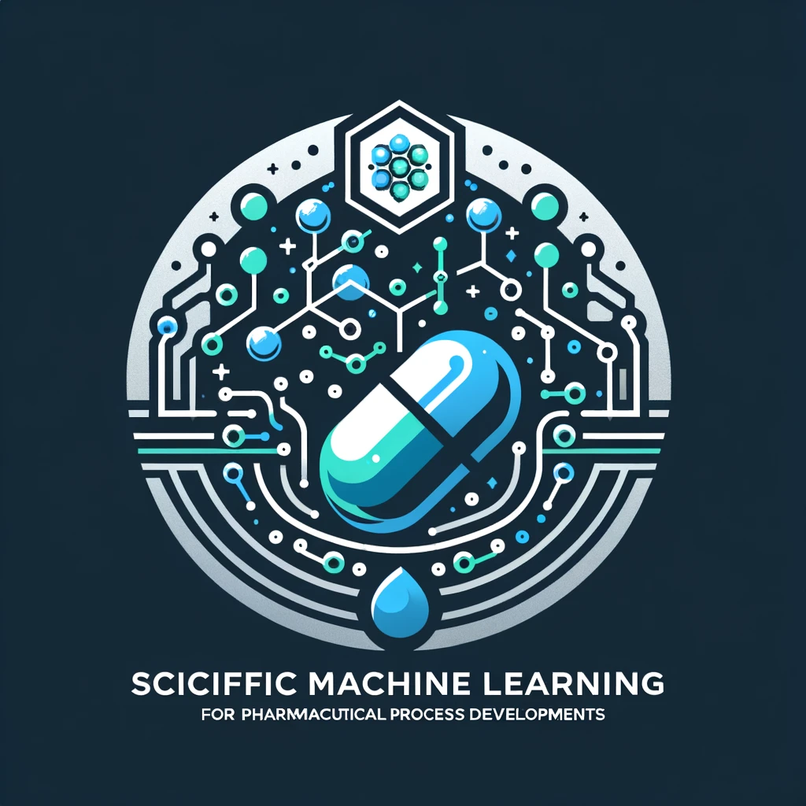

# Scientific Machine Learning for Biopharmacuetical Process Developments

The repository to create Machine Learning Algorithms and Examples for Scientific Problem specific to Biopharmaceutical process development.

# Introduction

In the realm of pharmaceutical development, the integration of Scientific Machine Learning (SciML) stands as a beacon of innovation, particularly through the utilization of deep learning and machine learning within the context of physical simulations. This repository, dubbed the "SciencticML repo," serves not just as an introduction but as a deep dive into the transformative potential of these technologies in pharmaceutical process development. It is meticulously designed to provide hands-on experience through Jupyter notebooks, covering a broad spectrum from standard supervised learning approaches to more sophisticated techniques such as physical loss constraints, differentiable simulations, reinforcement learning, and uncertainty modeling. The era we are navigating is marked by unprecedented opportunities, where the application of these advanced methods is poised to revolutionize our capabilities in simulation-based research and development.

The challenges in pharmaceutical process development are multifaceted and complex, requiring innovative solutions that this repository aims to address. The key areas of focus will include:
- [**Data Driven Dynamic Systems**](data_driven_dynamics/README.md): Exploring the data driven dynamics and its application in scientific machine learning for biopharmaceutical process development.
- **Integration of Deep Learning with Physical Sciences**: Demonstrating the use of deep learning to solve Partial Differential Equations (PDEs) and Ordinary Differential Equations (ODEs), thereby advancing the field beyond traditional computational methods.
- **Harmonizing Physics with Machine Learning**: Exploring strategies to meld machine learning with classical physics knowledge, enhancing the robustness and reliability of simulations without sidelining established numerical techniques.
- **Advancing Numerical Methods through AI**: Discussing the enhancement of field-based simulations with deep learning, acknowledging the existence of other machine learning techniques but focusing on the synergy between AI and numerical simulations.
- **Bridging the Gap between Synthetic and Real-World Data**: Highlighting the potential for future research to incorporate real-world data into simulations, moving beyond the reliance on synthetic data for modeling and validation.

This work is in progress and we'll keep updating it. The vision for this repository is not just to showcase the potential of these combined methodologies but to provide a practical framework for their application, aiming to bridge the gap between data-centric approaches and physical simulations.

The ambition of this initiative is to leverage the vast arsenal of numerical techniques available, optimizing their application through the integration of machine learning. A pivotal goal is to harmonize these domains, enabling the creation of hybrid systems that combine the specificity of neural networks with the generality of traditional solvers. Such systems have the potential not only to enhance the efficiency and accuracy of pharmaceutical process development but also to pioneer new methodologies that could significantly outperform existing solutions.

This introduction sets the stage for a comprehensive exploration of how Scientific Machine Learning can address and surmount the challenges inherent in pharmaceutical process development, heralding a new era of innovation and discovery.